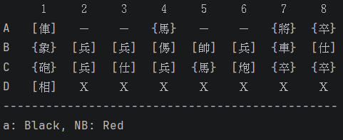
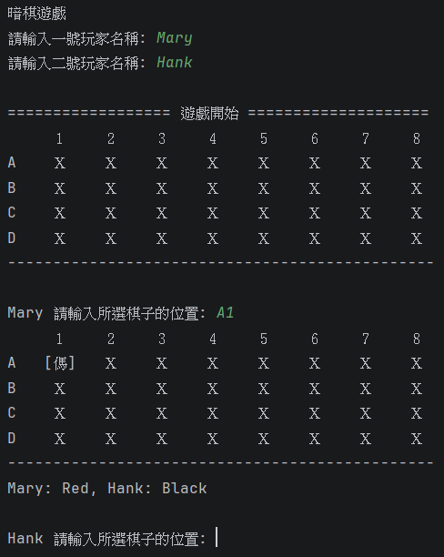
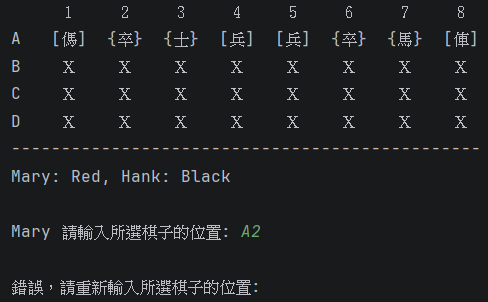
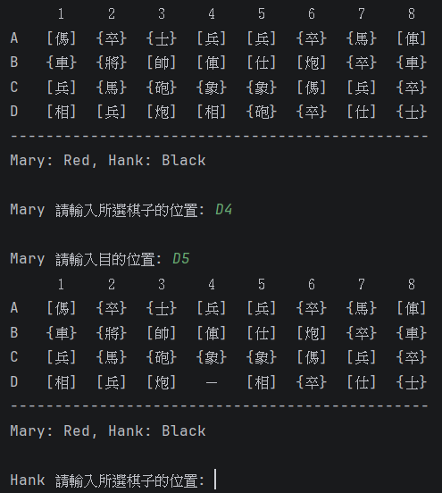
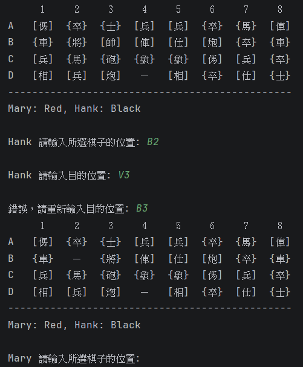
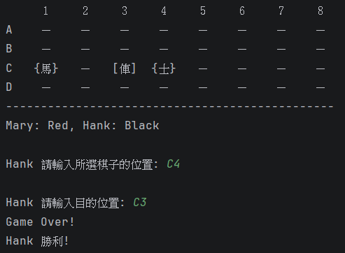

# H1 Report

* Name: 洪采萱
* ID: D1149474

---

## 題目：象棋翻棋遊戲 (OOP)

* 考慮一個象棋翻棋遊戲，32 個棋子會隨機的落在 4*8的棋盤上。透過 Chess 的建構子產生這些棋子並隨機編排位置，再印出這些棋子的名字、位置
* ChessGame
    * void showAllChess(); 
    * void generateChess();
* Chess: 
    * Chess(name, weight, side, loc); 
    * String toString();	
* 同上， 
    * ChessGame 繼承一個抽象的 AbstractGame; AbstractGame 宣告若干抽象的方法：
        * setPlayers(Player, Player)
        * boolean gameOver()
        * boolean move(int location)
* 撰寫一個簡單版、非 GUI 介面的 Chess 系統。使用者可以在 console 介面輸入所要選擇的棋子的位置 (例如 A2, B3)，若該位置的棋子未翻開則翻開，若以翻開則系統要求輸入目的的位置進行移動或吃子，如果不成功則系統提示錯誤回到原來狀態。每個動作都會重新顯示棋盤狀態。
* 規則：請參考 [這裏](https://zh.wikipedia.org/wiki/%E6%9A%97%E6%A3%8B#%E5%8F%B0%E7%81%A3%E6%9A%97%E6%A3%8B)

```
    1   2   3  4   5  6   7   8
 A  ＿  兵  ＿  車  Ｘ  ＿  象  Ｘ
 B  Ｘ  ＿  包  Ｘ  士  ＿  馬  Ｘ   
 C  象  兵  Ｘ  車  馬  ＿  ＿  將 
 D  Ｘ  包  ＿  士  兵  Ｘ  ＿  Ｘ  
```

## 設計方法概述

1. 先建立類別 Chess、Player、AbstractGame、ChessGame

2. Chess 除了有名稱 (name)、階級 (weight)、陣營 (side)、位置 (loc)，我還加上了是否翻開 (show)，以及是否被吃掉 (live)，使用函式 toString 時，紅方會使用 ```[ ]``` 來標記，黑方則是以 ```{ }``` 表示，若尚未被翻開，就會顯示 ```Ｘ```，被吃掉會回傳 ```－```。

3. Player 包含玩家名稱 (name) 與陣營 (side)

4. ChessGame 繼承 AbstractGame 後: 
    * setPlayer: 等一號玩家翻開第一個棋子後開始分陣營
    * gameOver: 如果一方的棋子全都被吃光或是沒路可走就會結束遊戲
    * move: 負責檢查棋子能不能移動到目的
    * generateChess: 先創建一個 list 放置棋子的座標 "00" ~ "37" ，然後使用隨機函式打亂，再創一個 4 * 8 的陣列 (chessBoard) 依照剛剛隨機打亂的座標位置來存放棋子
    * showAllChess: 顯示每回合的棋盤畫面
    * swap: 當棋子要 move 時，其實是把棋盤上的兩個棋子交換，在交換前把目的地的棋子 (target) 的 live 改成 false，這樣  時，就只會顯示 ```－``` 在畫面上
    * chessShow: 檢查該棋子是否為翻開狀態，若是就詢問使用者要移動到哪個地方，否則將該棋子翻開
    * checkInputCurrentChess, checkInputTarget: 防呆機制，用來確認使用者輸入的棋子座標是否正確

## 程式、執行畫面及其說明

### Chess
* 建構子
```java
String name, side;
int weight, loc;
boolean show=false, live=true; // 有沒有被翻開、吃掉
Chess(String name, int weight, String side, int loc) {
    this.name=name;
    this.weight=weight;
    this.side=side;
    this.loc=loc;
}
```

* toString
```java
public String toString(){
        if(show&&live)
        {
            if(side.equals("Red")){
                return "["+name+"]";
            }
            else
                return "{"+name+"}";
        }
        else if(live)
            return " Ｘ ";
        else
            return " － ";
    }
```

### Player
```java
public class Player {
    String name, side;
    Player(String name) {
        this.name = name;
    }

    public String getName() {
        return name;
    }

    public void setSide(String side) {
        this.side=side;
    }
    public String getSide() {
        return side;
    }
}
```

### ChessGame
* 變數
```java
Chess currentChess, target; // 選擇的棋子&目的地
String playerSide=""; // 顯示誰是紅黑方
Player[] p=new Player[2];
private ArrayList<Integer> loc=new ArrayList<>(); // 先生成座標"00"~"37"然後讓list隨機排列
public Chess[][] chessBoard=new Chess[4][8]; // 棋盤
```
* setPlayer
```java
void setPlayer(Player p1, Player p2){
        p1.setSide(currentChess.getSide());
        playerSide=p1.getName()+": "+currentChess.getSide()+", "+p2.getName()+": ";
        if(currentChess.getSide().equals("Red")){
            p2.setSide("Black");
            playerSide+="Black";
        }
        else{
            p2.setSide("Red");
            playerSide+="Red";
        }
        p[0]=p1;
        p[1]=p2;
    }
```
* gameOver (內容過多，不全部顯示)
    1. 先檢查還有沒有棋子，如果有一方沒有任何棋子，則另一方獲得勝利
    2. 檢查的同時把所有剩下的棋子都放進list
    3. 檢查每個剩下的棋子是否至少能往上下左右其中一個方向移動
    4. 如果所有剩下的棋子都無法移動，則判定另一方勝利
```java
boolean gameOver(){
    int redChess=0, blackChess=0, x, y, xChess, yChess, redCannotMove=0, blackCannotMove=0;
    ArrayList<Chess> redLast=new ArrayList<>(); // 剩下的紅棋
    ArrayList<Chess> blackLast=new ArrayList<>(); // 剩下的黑棋
    for(int i=0;i<4;i++){
        for(int j=0;j<8;j++){
            if(chessBoard[i][j].live){
                if(chessBoard[i][j].getSide().equals("Red")){
                    redChess++; // 棋子還活著就 +1
                    redLast.add(chessBoard[i][j]);
                }
                else {
                    blackChess++;
                    blackLast.add(chessBoard[i][j]);
                }
            }
        }
    }
    if(redChess==0||blackChess==0){
        System.out.println("Game Over!");
        ... // 如果是紅方沒棋子則黑方勝利，反之則紅方勝
        return true;
    }
    else{
        // 紅棋檢查
        for(int i=0;i<redLast.size();i++){
            ... // 檢查每個棋子是否能上下左右移動
        }
        if(redCannotMove==redLast.size()){
            ... // 如果所有剩餘的棋子都不能移動則黑方勝利
        }
        ... // 黑棋檢查
    }
    return false;
}
```
* swap & move (內容過多，不全部顯示)
    1. 檢查棋子是否能朝該目的座標移動 (比較棋子階級&移動距離是否正常&炮的額外判定)
    2. 若可以移動則使用swap來讓兩個棋子交換
    3. 因為toString會判定棋子的顯示方法，所以交換後棋子原本的座標會顯示 ```"－"```
```java
void swap(int iBefore, int jBefore, int iAfter, int jAfter){
    int tmp=currentChess.getLoc();
    currentChess.loc=target.loc;
    target.loc=tmp;
    chessBoard[iBefore][jBefore]=target;
    chessBoard[iAfter][jAfter]=currentChess;
}
boolean move(int location){
    int iBefore=currentChess.getLoc()/10, jBefore= currentChess.getLoc()%10;
    int iAfter=location/10, jAfter=location%10, dx, dy;
    if(iAfter>3||jAfter>7||iAfter<0||jAfter<0)return false;
    target=chessBoard[iAfter][jAfter];
    if(currentChess.show==target.show){
        if(currentChess.getWeight()!=2){
            dx=Math.abs(iAfter-iBefore);
            dy=Math.abs(jAfter-jBefore);
            if(dx+dy==1){
                if(!target.live) {
                    swap(iBefore, jBefore, iAfter, jAfter);
                    return true;
                }
                else{
                    if(!currentChess.getSide().equals(target.getSide())){
                        boolean boss=currentChess.getWeight()==7&&target.getWeight()!=1,
                                highWeight=currentChess.getWeight()>=target.getWeight(),
                                eatBoss=currentChess.getWeight()==1&&target.getWeight()==7,
                                bossCannot=currentChess.getWeight()==7&&target.getWeight()==1;
                        if((boss||highWeight||eatBoss)&&!bossCannot){
                            target.live=false;
                            swap(iBefore, jBefore, iAfter, jAfter);
                            return true;
                        }

                    }
                }

            }
        }
        else{ // 炮的額外判定，確認與目的座標之間只有一個棋子即可移動 
            ...
        }
    }
    return false;
}
```
* showAllChess: 顯示當前棋盤與玩家紅黑方
```java
void showAllChess(){
        System.out.print("   ");
        String s="１２３４５６７８";
        for(int i=0;i<8;i++)
            System.out.printf("  %c  ", s.charAt(i));
        System.out.println();
        for(int i=0;i<4;i++) {
            System.out.printf("%c  ", 'A'+i);
            for(int j=0;j<8;j++){
                System.out.printf(" %s ", chessBoard[i][j].toString());
            }
            System.out.println();
        }
        System.out.println("-----------------------------------------------");
        if(!playerSide.isEmpty())System.out.println(playerSide);
    }
```
顯示畫面:



* generateChess
    1. 隨機生成每個棋子位置與設定棋子名稱、階級、陣營等
    2. 帥/將 ~ 兵/卒 對應階級為 7 ~ 1
```java
void generateChess(){
        for(int i=0;i<4;i++){ // 生成 00 ~ 37 (A 對應 0，D 對應 3)
            for(int j=0;j<8;j++) {
                loc.add(i*10+j);
            }
        }
        Collections.shuffle(loc); //打亂座標排序
        chessBoard[loc.get(tmp)/10][loc.get(tmp)%10]=new Chess("將", 7, "Black", loc.get(tmp++));
        chessBoard[loc.get(tmp)/10][loc.get(tmp)%10]=new Chess("帥", 7, "Red", loc.get(tmp++));
        ... // 同上，只是改成其他棋子
    }
```
* chessShow: 判斷該棋子是否已翻開
```java
boolean chessShow(int location){
    currentChess=chessBoard[location/10][location%10];

    if(currentChess.show){
        return true; // 移動
    }
    else{
        currentChess.show=true;
        if(first==0)first++;
        return false; // 翻開
    }
}
```
* checkInputCurrentChess: 檢查使用者的輸入是否符合規定
```java
boolean checkInputCurrentChess(String input, Player player){
        if(input.length()!=2)return true;
        int i=input.charAt(0)-'A', j=input.charAt(1)-'1';
        if(i>3||j>7)return true;
        if(first!=0&&chessBoard[i][j].show){
            if(!chessBoard[i][j].getSide().equals(player.getSide()))return true;
        }
        if(!chessBoard[i][j].live)return true; // 死掉的不能選
        return false;
    }
```
### Main

1. 先請兩位玩家輸入名稱
2. 一號玩家翻開第一個棋子後，設定兩位玩家的陣營
3. 建立防呆機制，避免使用者輸入錯誤 / 選錯棋子 / 選錯目的座標
4. 選擇一個棋子並輸入錯誤目的座標後，輸入 esc 可重新選擇要移動的棋子
5. 每完成一次移動，都會檢查遊戲是否能繼續
```java
public class Main {
    public static void main(String[] args) {

        System.out.println("暗棋遊戲");

        Player[] players=new Player[2];
        int p=0;
        System.out.print("請輸入一號玩家名稱: ");
        Scanner sc=new Scanner(System.in);
        players[0]=new Player(sc.next());
        System.out.print("請輸入二號玩家名稱: ");
        players[1]=new Player(sc.next());

        System.out.println("\n================== 遊戲開始 ====================");
        ChessGame game=new ChessGame();
        game.generateChess();

        // 第一次選棋子決定玩家紅黑方
        game.showAllChess();
        System.out.printf("\n%s 請輸入所選棋子的位置: ", players[p++].getName());
        String chessLoc=sc.next();
        int i, j;
        while(game.checkInputCurrentChess(chessLoc, players[0])){
            System.out.print("\n錯誤，請重新輸入所選棋子的位置: ");
            chessLoc=sc.next();
        }
        i=chessLoc.charAt(0)-'A';
        j=chessLoc.charAt(1)-'1';
        game.chessShow(i*10+j); // 翻棋
        game.setPlayer(players[0], players[1]);

        while(!game.gameOver()){
            game.showAllChess();
            System.out.printf("\n%s 請輸入所選棋子的位置: ", players[p].getName());
            chessLoc=sc.next();
            while(game.checkInputCurrentChess(chessLoc, players[p])){
                System.out.print("\n錯誤，請重新輸入所選棋子的位置: ");
                chessLoc=sc.next();
            }
            i=chessLoc.charAt(0)-'A';
            j=chessLoc.charAt(1)-'1';
            if(game.chessShow(i*10+j)){
                System.out.printf("\n%s 請輸入目的位置: ", players[p].getName());
                chessLoc=sc.next();
                while(game.checkInputTarget(chessLoc, players[p])){
                    System.out.print("\n錯誤，請重新輸入目的位置: ");
                    chessLoc=sc.next();
                }
                i=chessLoc.charAt(0)-'A';
                j=chessLoc.charAt(1)-'1';
                while(!game.move(i*10+j)){
                    System.out.print("\n無法移動到該位置，請重新輸入目的位置: ");
                    chessLoc=sc.next();
                    if(chessLoc.equals("esc")){
                        p=1-p;
                        break;
                    }
                    while(game.checkInputTarget(chessLoc, players[p])){
                        System.out.print("\n錯誤，請重新輸入目的位置: ");
                        chessLoc=sc.next();
                    }
                    i=chessLoc.charAt(0)-'A';
                    j=chessLoc.charAt(1)-'1';
                }
            }

            p=1-p; // 換另一個人下棋
        }
    }

}
```
### 執行畫面
* 遊戲一開始的畫面，以及一號玩家選擇翻開的棋子後，會開始顯示陣營 (紅方用中括號，黑方用大括號)

    

* 選錯棋子時，會觸發提醒，並要求重新輸入

    

* 先輸入已翻開的棋子，可輸入要移動到哪裡

    

* 輸入錯誤的移動會出現警告，並要求重新輸入

    

* 遊戲結束

    

# AI 使用狀況與心得

使用層級: (層級2) 用來除錯，且改善功能、架構

大概問了十幾二十次，大部分是拿來除錯，或是我有一個想法，但不確定可不可行，就請他提供一些相關的方法，不過其實還是習慣自己上網查。因為之前比較常寫 Python，所以對 Java 的語法與架構不是很熟悉，經常不自覺寫出 Python 的寫法而不自知，因此透過 AI 協助我轉換成相對應的 Java 寫法，比如字串相等要用equals但我用了等號、如何把座標字串強制轉型進行計算等。

## 心得

不知道是不是 AI 對暗棋沒有很熟悉，一開始其實有嘗試直接複製老師給的提示全部丟給它看他會怎麼寫，雖然它沒有寫的很完整，只有提供給我大概的架構，但看起來不是我想要的，因此我選擇自己寫，順便增加手感，不知道怎麼改再請它幫我 debug，不過因為時間不夠，原本還想讓AI嘗試幫我優化很多糟糕的程式碼，畢竟時隔兩年多接觸物件導向，真的非常的陌生，感覺自己寫的很多部分都不是很 OOP，甚至本身對暗棋也不是很了解，原本以為應該可以寫很快，沒想到每測試一場棋局，就需要花費一堆時間去找 bug，比如將居然被仕吃了、炮移動到目的地後，只有跟那個棋子交換位置，對方德棋子還活著沒有被吃掉，雖然很多莫名其妙的問題出現，但我覺得整體來說還是很好玩的。

## 後續 (after 3/16)

是的沒錯，我優化失敗了... Orz

原本只是想把自己冗長的程式碼重構並加上完整的封裝，但它很沒救的出現奇怪的行為 (不排除是因為我感冒頭暈腦脹找不出 bug)，比如：黑方的士在 A1，剛好 A2 跟 A3 都是紅方的棋子，而且比士的階級低，因此當我輸入要讓 A1 吃掉 A2 的棋子時，原本在 A1 的士直接把 A2 和 A3 的棋子都吃掉，然後移動到 A3。

我現在正在深刻的反省自己想到什麼就寫什麼的壞習慣，也體會到事先規劃好 Class 與 Method 的功能，以及嚴格遵守 OOP 的重要性了，我下次一定會優先做完封裝，再完善系統功能，並學會善用 AI，這次是因為想要找回寫 Java 的手感，所以選擇手刻。

最後，我其實有嘗試把程式碼全部丟給 AI 請它幫我優化，雖然它的整體架構確實比我原先的好，但是它不只棋盤跑版了，輸入錯誤座標後輸入esc要重新選擇移動的棋子時，它直接變成請另一位玩家選擇棋子，因此我覺得 AI 可能還是適合一點一點用，不太能一次給它一堆東西讓它優化。